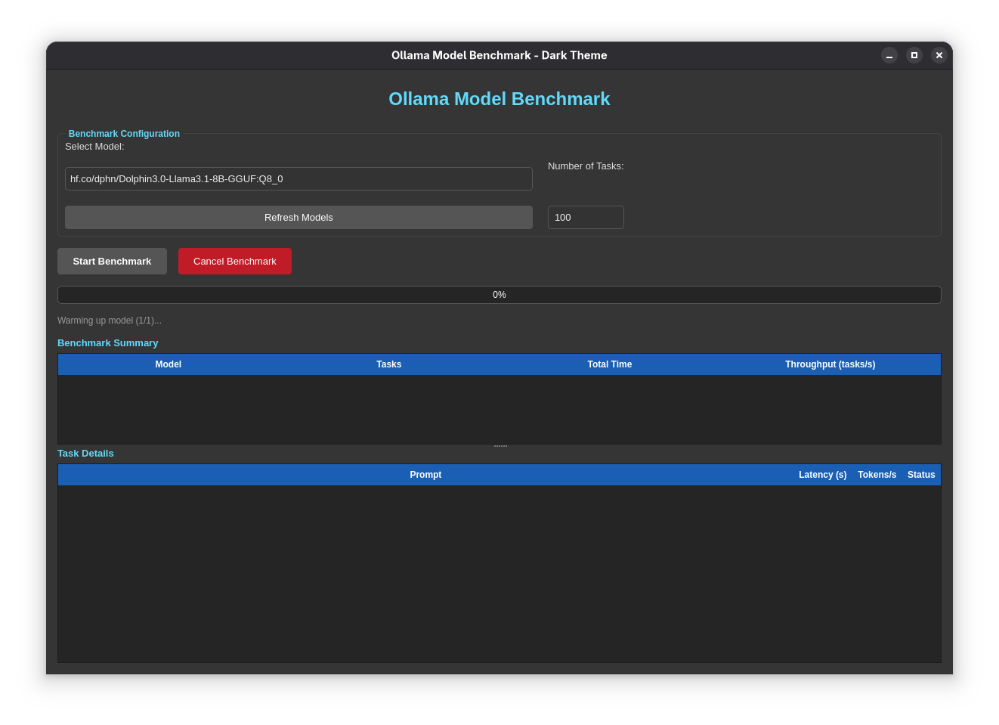
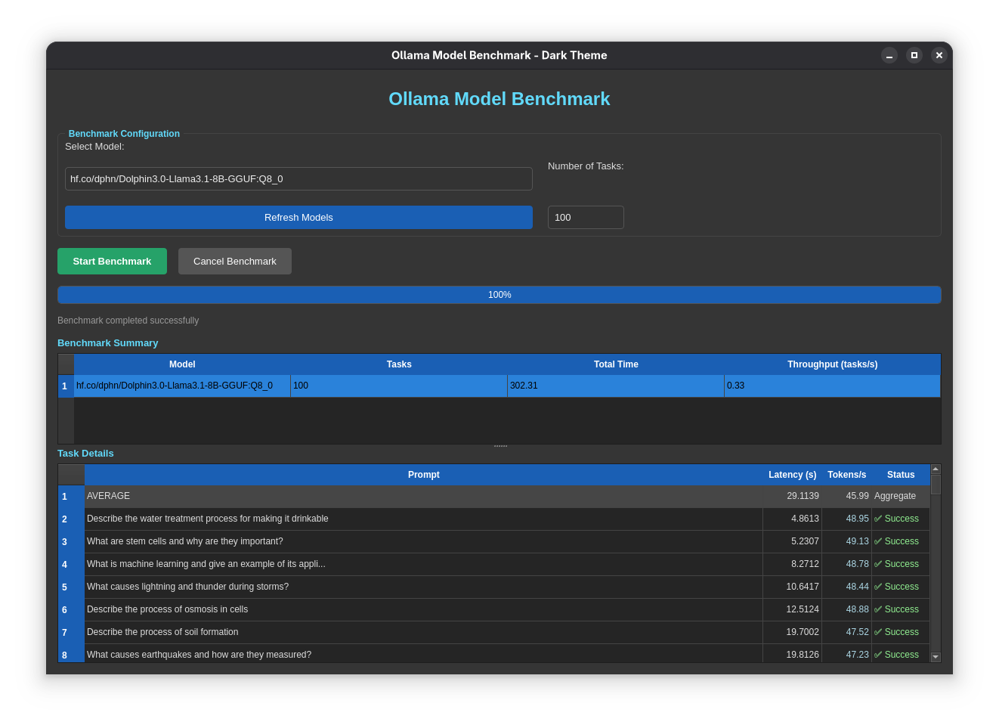
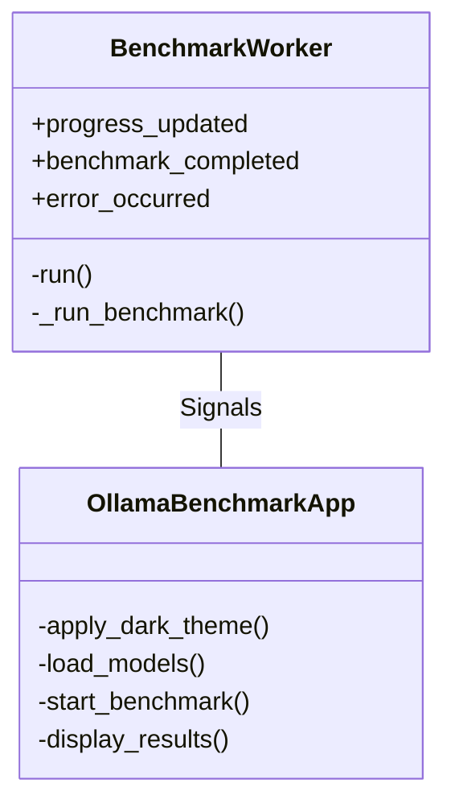

# 🚀 Ollama Model Benchmark Tool


A professional benchmarking tool for evaluating Ollama language models. Measure performance metrics including latency, throughput, and token generation speed through a sophisticated PyQt5 GUI.

 *(Screenshot placeholder - replace with actual image)*

## ✨ Features

### 🧪 Performance Testing
- **Concurrent Benchmarking**: Test with up to 10 simultaneous requests
- **Comprehensive Metrics**:
  - Request latency
  - Tokens/second generation
  - Throughput (tasks/second)
  - Total execution time
- **Warm-up Runs**: Initial iterations ensure accurate benchmarking

### 🖥️ User Experience
- **Dark Theme UI**: Professional interface with eye-friendly design
- **Real-time Monitoring**: Progress tracking during benchmark execution
- **Result Visualization**: Color-coded performance indicators
- **Detailed Reports**: Task-level performance breakdowns

### ⚙️ Customization
- **100+ Diverse Prompts**: Pre-configured benchmark questions
- **Adjustable Parameters**:
  - Task count (1-200)
  - Model selection
  - Concurrency control
- **JSON Export**: Automatic saving of benchmark results

## 📦 Installation

### Prerequisites
- Python 3.7+
- Ollama running locally (`http://localhost:11434`)
- Installed Ollama models

### Setup
```bash
# Clone repository
git clone https://github.com/Laszlobeer/llm-tester.git
cd llm-tester

# Install dependencies
pip install PyQt5 requests

# Launch application
python app.py
```

## 🧭 Usage

1. **Model Selection**:
   - Choose from detected Ollama models
   - Refresh list if needed
   
2. **Configure Test**:
   - Set number of tasks (default: 100)
   - View available prompts in code

3. **Execute Benchmark**:
   ```mermaid
   graph LR
   A[Start Benchmark] --> B{Warm-up Runs}
   B --> C[Concurrent Testing]
   C --> D[Results Collection]
   D --> E[Metrics Calculation]
   E --> F[Display Results]
   ```

4. **Analyze Results**:
   - Summary table shows aggregate metrics
   - Detail table displays task-level performance
   - Automatic JSON export on exit

## ⚙️ Configuration

Customize in `app.py`:
```python
# Network configuration
OLLAMA_HOST = "http://localhost:11434"  # Remote instance URL

# Benchmark parameters
WARMUP_RUNS = 1                         # Warm-up iterations
CONCURRENCY_LEVEL = 10                  # Max concurrent requests

# Custom prompts (100+ available)
BENCHMARK_PROMPTS = [
    "Explain quantum computing in simple terms",
    "Write a Python function for Fibonacci sequence",
    # ... add your own prompts
]
```

## 🧠 Technical Implementation

### Architecture


### Metrics Collected
| Metric | Description | Calculation |
|--------|-------------|-------------|
| **Latency** | API response time | `end_time - start_time` |
| **Tokens/s** | Generation speed | `eval_count / eval_duration` |
| **Throughput** | Tasks processed per second | `task_count / total_time` |
| **Total Time** | Complete benchmark duration | Sum of all operations |

## ❓ FAQ

### Model Detection Issues
**Q:** Why does the tool show "No models found"?  
**A:** Ensure:
1. Ollama is running (`ollama serve`)
2. Models are installed (`ollama list`)
3. Correct host address in configuration

### Customization
**Q:** Can I test remote Ollama instances?  
**A:** Yes! Modify `OLLAMA_HOST` to point to your remote instance

**Q:** How can I add custom prompts?  
**A:** Edit the `BENCHMARK_PROMPTS` list in the code

## 🤝 Contributing

We welcome contributions! Here's how to help:

1. Report bugs or request features via [Issues](https://github.com/Laszlobeer/llm-tester/issues)
2. Submit improvements through Pull Requests:
   ```bash
   fork repository
   create feature branch (git checkout -b feature/improvement)
   commit changes (git commit -am 'Add new feature')
   push branch (git push origin feature/improvement)
   open pull request
   ```

3. Areas for contribution:
   - Additional performance metrics
   - Enhanced visualization
   - More benchmark prompts
   - Docker support

## 📜 License

This project is licensed under the MIT License - see the [LICENSE](LICENSE) file for details.


